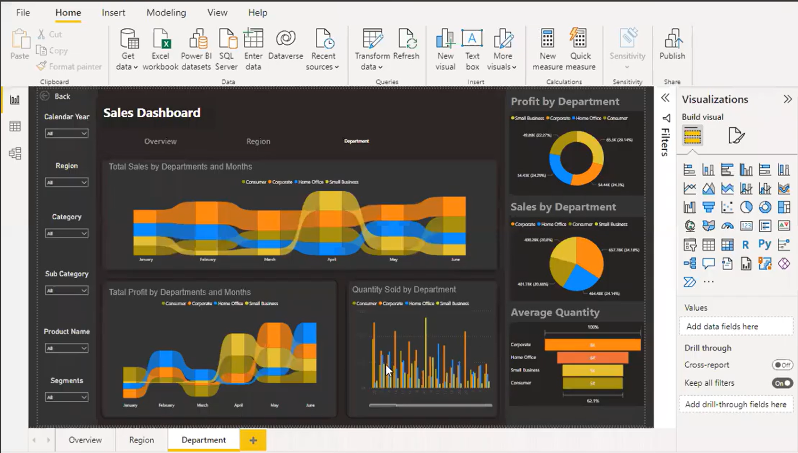
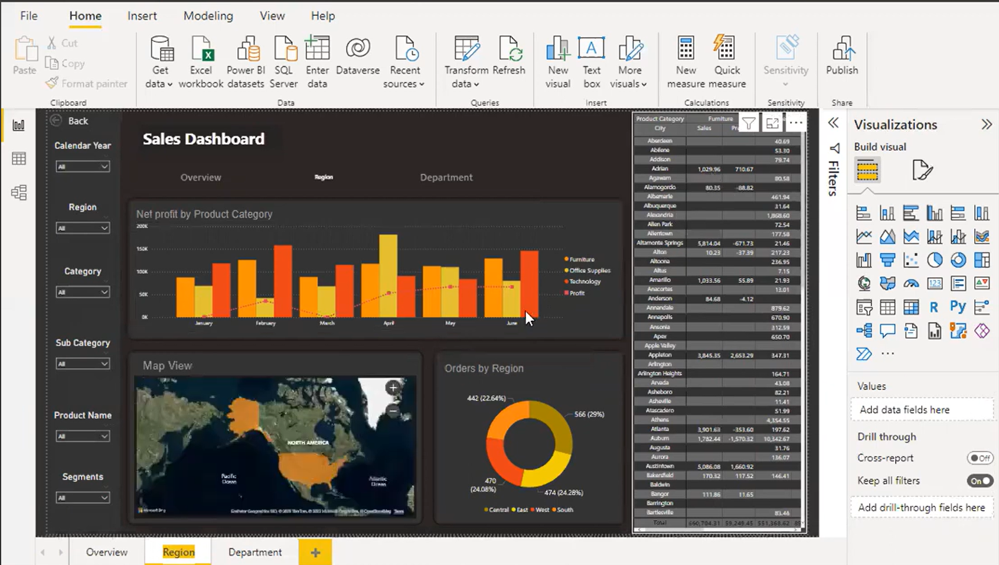
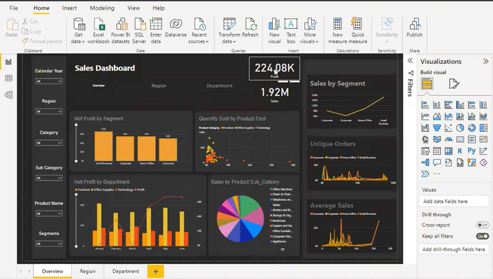

# Power BI KPI Dashboard Project

## Overview
This project focuses on transforming raw business data into interactive KPI dashboards using Power BI.

The dashboard was developed as part of a university competition and was awarded 1st place.

## Tools Used
- Power BI
- Power Query
- Excel (Data Source)

## Key Features
- Interactive KPI visualization
- Dynamic filtering and drill-down analysis
- Data transformation using Power Query
- Business performance monitoring dashboard

## Business Impact
The dashboard improved clarity of performance metrics and supported data-driven presentation for stakeholders.

## Screenshots

